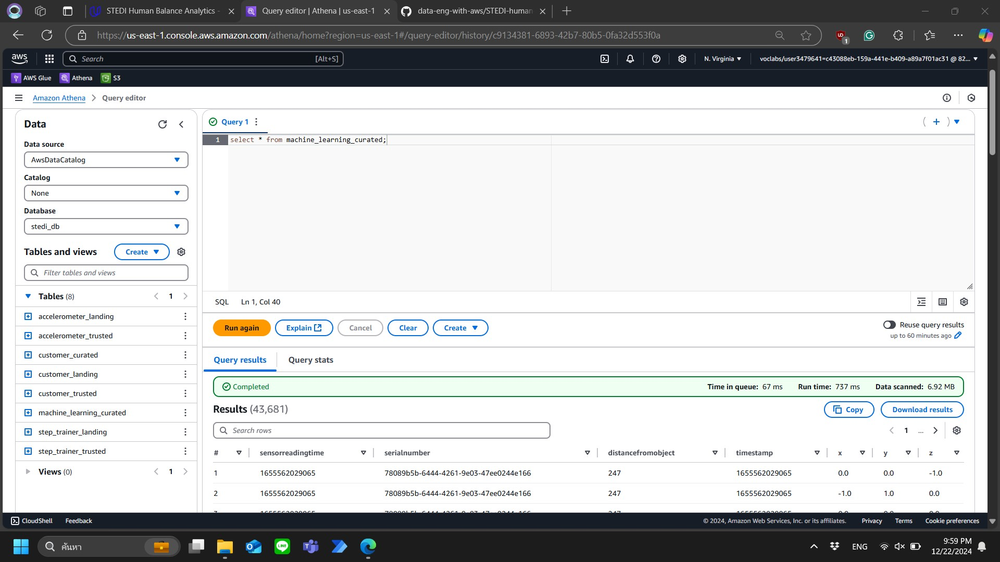

# STEDI Human Balance Analytics

## Implementation

### Landing Zone
SQL scripts:
- [customer_landing.sql](./scripts/customer_landing.sql)
- [accelerometer_landing.sql](./scripts/accelerometer_landing.sql)
- [step_trainer_landing.sql](./scripts/step_trainer_landing.sql)

#### Customer Landing Query Result

#### Customer Landing with shareWithResearchAsOfDate is null

#### Accelerometer Landing Query Result

#### Step Trainer Landing Query Result

### Trusted Zone
Job scripts:
- [customer_landing_to_trusted.py](./scripts/customer_landing_to_trusted.py)
- [accelerometer_landing_to_trusted.py](./scripts/accelerometer_landing_to_trusted.py)
- [step_trainer_landing_to_trusted.py](./scripts/step_trainer_landing_to_trusted.py)

#### Customer Trusted Query Result

#### Customer Landing with shareWithResearchAsOfDate is not null

#### Accelerometer Trusted Query Result

#### Step Trainer Trusted Query Result

### Curated Zone
Job scripts:
- [customer_trusted_to_curated.py](./scripts/customer_trusted_to_curated.py)
- [step_trainer_trusted_to_curated.py](./scripts/step_trainer_trusted_to_curated.py)

#### Customer Curated Query Result

#### Machine Learning Curated Query Result

